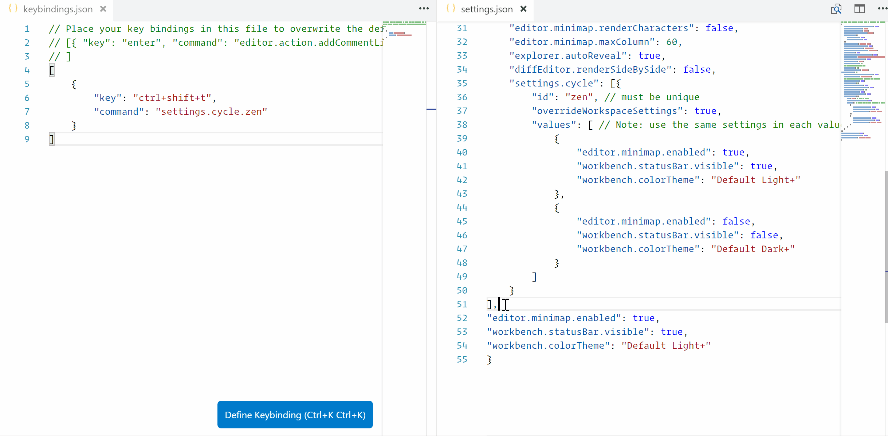

# Settings Cycler

## Summary
Sometimes VS Code ships a new feature without a toggle command (`editor.minimap.enabled`, `explorer.autoReveal`). Sometimes you want to easily toggle between a light and dark themes. Maybe you want to do something even more complex.

This extension allows configuring commands to cycle through settings. At its simplest, this allows toggling things such as the minimap or explorer autoReveal. At it's more complex, it allows cycling through a list of complex object values for a setting.

After configuring ([see below](#how-to-use)), you can cycle through values by assigning keyboard shortcuts to commands like `settings.cycle.editor.minimap.enabled` and `settings.cycle.explorer.autoReveal`.

The commands will check if a workspace setting is set, then a user setting, and if neither is set will default to changing workspace settings.



## Inspiration:
A gitter user asked if it was possible to toggle `explorer.autoReveal` via a keyboard shortcut. It isn't, but I realized how general this problem was.

## How to Use:
There is a two-step process to creating commands to toggle settings.

### Step 1: Add a configuration for the setting
`settings.cycle` holds a list of settings that the extension should create commands for. To toggle between the default light and dark themes, add an object with the `setting` property set to `"workbench.colorTheme"`, and an array of the string values to toggle through.

__Note:__ The values don't have to be strings, they can be numbers, booleans, or even arrays and objects.

```json
"settings.cycle": [
    {
        "setting": "workbench.colorTheme",
        "values": [
            "Default Dark+",
            "Default Light+"
        ]
    }
]
```

### Step 2: Configure a keyboard shortcut

Each setting added to the array will generate a command that looks like `settings.cycle.<setting name>`. So to configure a keybinding to toggle between the values set for `workbench.colorTheme`, add something like this to `keybindings.json`.

```json
{
    "key": "ctrl+shift+t",
    "command": "settings.cycle.workbench.colorTheme",
    "when": ""
}
```

## See More

This is a part of the my [API Playground repository](https://www.github.com/hoovercj/vscode-api-playground). Each subdirectory is a self-contained extension that demonstrates a particular API, repros a bug, answers a stackoverflow question, etc.

## Apis Used:
* [Commands](https://code.visualstudio.com/docs/extensionAPI/vscode-api#_commands) - The commands API provides a way to add commands which can be triggered from the command palette or via key bindings. As demonstrated in this extension, they can be generated dynamically at runtime to create rich, semantic commands.
* [Configuration](https://code.visualstudio.com/docs/extensionAPI/vscode-api#WorkspaceConfiguration) - The configuration API handles user and workspace settings for vscode. It allows extensions to react to configuration changes, to read configuration settings, and to write to them.

## Release Notes

### 0.0.2
* Fixed README icon

### 0.0.1
Initial release
* Added `settings.cycle` configuration
* Generate `settings.cycle.<setting name>` commands